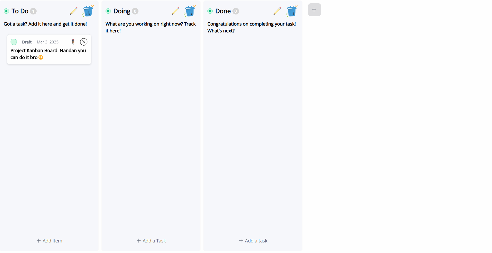

# Kanban Board

A modern, responsive Kanban board built with vanilla JavaScript, featuring drag-and-drop functionality, local storage persistence, and a clean user interface.



## ✨ Features

- **📋 Board Management**

  - Create, edit, and delete boards
  - Customize board colors and descriptions
  - Drag-and-drop organization
  - Real-time task counting

- **✅ Task Management**

  - Add tasks with custom colors
  - Edit task content
  - Delete tasks
  - Drag tasks between boards
  - Status tracking

- **💾 Data Persistence**

  - Automatic saves to localStorage
  - Load previous session state
  - No database required

- **🎨 UI/UX Features**
  - Responsive design for all devices
  - Smooth animations
  - Visual feedback for actions
  - Customizable task colors
  - Clean, modern interface

## 🚀 Getting Started

### Prerequisites

- Modern web browser (Chrome, Firefox, Safari, Edge)
- No additional dependencies required

### Quick Start

1. Clone the repository:

```bash
git clone https://github.com/nandanNM/kanban-board.git
```

2. Navigate to the project directory:

```bash
cd kanban-board
```

3. Open `index.html` in your web browser or use a local server:

## Usage

- **Add a New Board**: Click the '+' button on the right side
- **Add Tasks**: Click 'Add a Task' button within any board
- **Move Tasks**: Drag and drop tasks between boards
- **Edit Board**: Click the edit icon to modify board details
- **Delete Board/Task**: Click the delete icon on the board or task

## Technical Details

### Project Structure

```
kanban-board/
│
├── index.html      # Main HTML structure
├── style.css       # Styling and animations
├── script.js       # JavaScript functionality
└── README.md       # Project documentation
```

### Technologies Used

- HTML5 (Drag and Drop API)
- CSS3 (Flexbox, Transitions, Animations)
- Vanilla JavaScript (ES6+)
- LocalStorage API for data persistence

## Contributing

1. Fork the repository
2. Create your feature branch (`git checkout -b feature/AmazingFeature`)
3. Commit your changes (`git commit -m 'Add some AmazingFeature'`)
4. Push to the branch (`git push origin feature/AmazingFeature`)
5. Open a Pull Request

## License

This project is licensed under the MIT License - see the [LICENSE](LICENSE) file for details.

## Acknowledgments

- Icons provided by [Icons8](https://icons8.com/)
- Inspired by Trello and other Kanban board implementations
